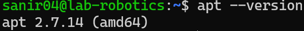
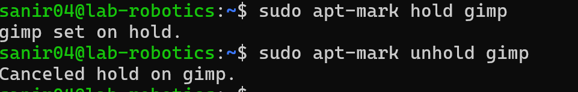

# Linux Assignment: 6
- Sanir Subedi amk1002731@student.hamk.fi
### Objective 
- Learn how to install, update, remove, and search for software using APT (Advanced Package Tool).
- Understand how to manage repositories and resolve package dependencies.
- Gain hands-on experience in troubleshooting package installation issues.

***

**Part1:Understanding APT& System Updates**

- Run the following command to display the installed APT version:

```bash
apt --version
```
  

### 2. Update the package list

```bash
sudo apt update
```
  

### Why is this important?
- Refreshes the list and all the available packages from repositories but does not install .Ensure system knows the latest update. 
### 3. Upgrade installed packages
```bash
sudo apt upgrade -y
```
- y flag automatically confims the upgrade without user input 

  

### Difference between update and upgrade:


| Update|Upgrade | 
| ---| --- | 
| Fetches information about available updates.| It installs newer versions of the package. |

###  4. View pending updates(if any)

- lists the packages that can be upgraded but have not been updated yet.

```bash
sudo apt list --upgradable
```

 

---

## Part 2: Installing & Managing Packages

### 5. Search for a package using APT
```bash
apt search image editor
```
- I used gimp image editor as an example.IT is an advanced image editor

### 6. View package details
```bash
apt show gimp
```
 

### 7. Install a package
```bash
sudo apt install gimp -y
```

### 8. Check installed package version
```bash
apt list --installed | grep gimp
```
---

## Part 3: Removing & Cleaning Packages

### 9. Uninstall the package
```bash
sudo apt remove gimp -y
```


### Is the package fully removed?
- No, configuration files are still there. 

### 10. Remove configuration files as well
``` bash
sudo apt purge gimp -y
```

### What is the difference between remove and purge?


| Remove|Purge | 
| ---| --- | 
| It  removes the package but keeps configuration files.| It removes the package along with its configuration files.|


### 11. Remove package dependencies
```bash
sudo apt autoremove -y
```


### Why is this step important?
- This removes unused dependencies that were left behind after removing packets. 

### 12. Clean up downloaded package files
```bash 
sudo apt clean
```

### What does this command do?


- It removes cached package files .deb files from /var/cache/apt/archives/. 

---

## Part 4: Managing Repositories & Troubleshooting

### 13. List all available repositories

```bash 
sudo cat /etc/apt/sources.list
```


### 14. Add a new repository
```bash
sudo add-apt-repository universe
sudo apt update
```


### What types of packages are found in the universe repository?
- Contains community maintained open source software. 

### 15.  Simulate an installation failure and troubleshoot
```bash
sudo apt install fakepackage
```
### What error message do you get?
  ```bash 
  Unable to locate package fakepackage
  ```


### How would you troubleshoot this issue?

- Check if the package name is correct.
- Ensure the repository containing the package is enabled (sudo apt update).
- Search for the package using apt search.

---
---

# Bonus Challenge 

### 1. Use apt-mark to hold and unhold a package
```bash 
sudo apt-mark hold gimp 
```
### 2. Use apt-mark to unhold a package
```bash
sudo apt-mark unhold gimp
```

***image***




### Why would you want to hold a package?
- Holding a package prevents it from being upgraded, 
       - some scenarios 
           - prevent dependencies 
           - Avoid unwanted feature changes 

