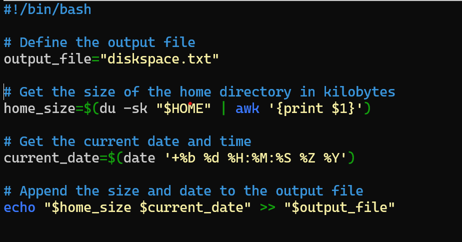

# Linux Management - Assignment 05

- Sanir Subedi amk1002731@student.hamk.fi

## Automating a Script with Cron

### Task Overview
- Create a script `print.sh` that records the home directory size and timestamp.
- Automate execution using `cron` to run every 12 hours.
- Ensure the script runs at least six times.
- Use `awk` to extract the maximum recorded size from `diskspace.txt`.

---

## Step 1: Writing the `print.sh` Script
The script captures the home directory size in KB and appends it to `diskspace.txt` with a timestamp.

### **Script Contents**
```bash
#!/bin/bash

# Define the output file
output_file="diskspace.txt"

# Get the size of the home directory in kilobytes
home_size=$(du -sk "$HOME" | awk '{print $1}')

# Get the current date and time
current_date=$(date '+%b %d %H:%M:%S %Z %Y')

# Append the size and date to the output file
echo "$home_size $current_date" >> "$output_file"

```
  


Save this script as `print.sh` and make it executable:

```bash
chmod +x print.sh
```

---

## Step 2: Automating Execution with Cron
Use `crontab` to schedule execution every 12 hours.

### **Edit Crontab**
Run:
```bash
crontab -e
```
Add the following line:
```bash
0 */12 * * * /home/sanir/print.sh
```
To test the script more frequently (e.g., every minute), modify as follows:

```bash
* * * * * /home/sanir/print.sh
```
Check scheduled jobs:
```bash
crontab -l
```


---

## Step 3: Extracting the Maximum Recorded Size
To find the maximum home directory size from `diskspace.txt`, use `awk`:

### **AWK Command**
```bash
awk '{if($1 > max) {max=$1; line=$0}} END {print "Max=" max ", at " substr(line, index(line, $2))}' diskspace.txt
```

### **Explanation:**
1. **`$1`** contains the home directory size.
2. **`max`** stores the largest encountered value.
3. **`line`** keeps the corresponding full line.

4. The final output prints:
   ```
   Max=2546877, at Feb 16 12:00:01 UTC 2025
   ```

---

## Additional AWK Commands for Data Analysis

### **Read All Lines**
```bash
awk '$1 {print $0}' diskspace.txt
```

### **Read Only the First Field (Size)**
```bash
awk '$1 {print $1}' diskspace.txt
```

### **Print Last Recorded Entry**
```bash
awk 'END {print $1}' diskspace.txt
```

### **Print Maximum Value and Corresponding Data**
```bash
awk '{if($1>max){max=$1; line=$0}} END {print max, " and the Data is ", line }' diskspace.txt
```

---

## Step 4: Verification
To verify script functionality:
```bash
echo "Sanir Subedi"
```
Output:
```bash
Sanir Subedi
```

---

## Conclusion
- **Automated script execution** using `cron`.
- **Recorded home directory size with timestamps**.
- **Extracted and displayed the maximum recorded size** using `awk`.


