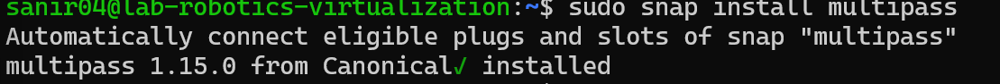
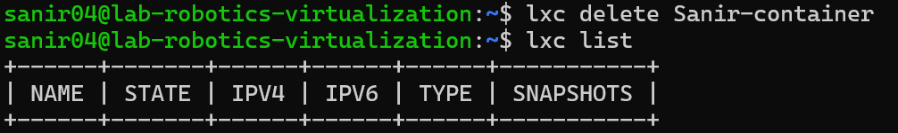
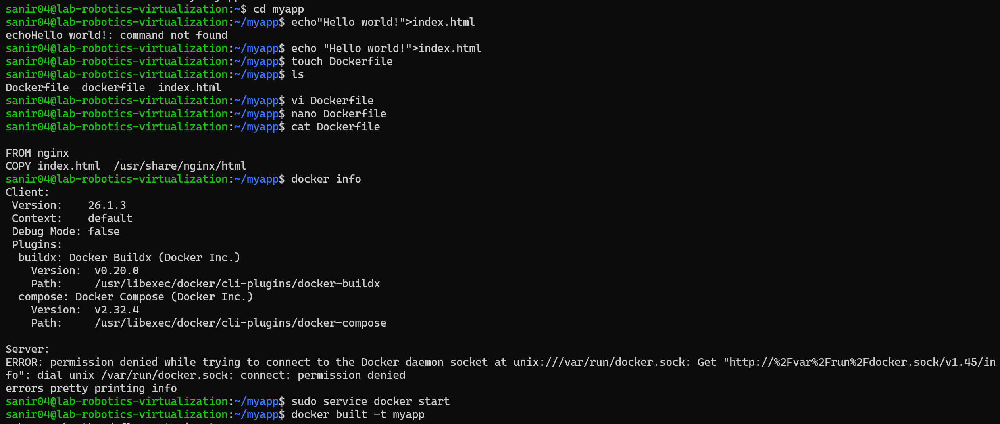
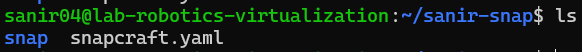

# Virtualization 
- Sanir Subedi: amk1002731@student.hamk.fi
 

## Part 1: Introduction to virtualization concepts

1. *** Virtualization ***:A technology that lets you create virtual versions of computers, storage, or networks. It’s like running multiple computers inside one real computer.
2. ***Hypervisor***: A software that creates and runs virtual machines. Think of it as a manager that allows multiple operating systems to run on the same computer.
3. ***Virtual machines*** (VM): A software-based computer that acts like a real one. It has its own operating system, apps, and files, but runs inside another computer using a hypervisor.
4. ***Containers***: A container is a sandboxed process running on a host machine that is isolated from all other processes running on that host machine. Containers are a lighter-weight, more agile way of handling virtualization—since they don’t use a hypervisor.It is an isolated environments that run applications with shared system resources.

-  The main differences between VMs and Container:


| Feature                | Virtual Machine (VM)         | Container                   |
|------------------------|------------------------------|-----------------------------|
| **Isolation**          | Full OS-level isolation      | Process-level isolation     |
| **Performance**        | Slower         | Faster, shares host OS      |
| **Size**               | Large             | Small (MBs)                |
| **Startup Time**       | Slower           | Faster (seconds)           |
| **Resource Efficiency**| Less efficient              | More efficient              |
| **Portability**        | Less portable               | Highly portable             |
| **Use Case**           | Running multiple OSes       | Running app dependencies   |
| **Example Technologies**| VMware, VirtualBox         | Docker, Kubernetes         |


## Part 2: Working with Multipass

1. multipass boot: Launch the default Ubuntu instance.




2. multipass list: List all running instance.

3. multipass info: View details about a specific instance.

4. multipass shell: Access to the shell of a running instance.

5. multipass exec: Run the command on the instance.

6. multipass stop: Stop the running instance.

7. multipass delete: Delete the instance.


### Learn About Cloud-Init

1. **Create a cloud-init.yaml file**

```bash
nano cloud-init.yaml
```
- Screenshot of creating a cloud-init.yaml file.


2. **Launch an instance with cloud-init**
```bash
multipass launch --name SanirVM --cloud-init cloud-init.yaml
```


3.**Create a new folder and Mount the folder inside a VM**:
```bash
mkdir ~/multipass_shared
multipass mount ~/multipass_shared SanirVM:/mnt/shared
```

```bash 
echo "Hello, World!" > ~/multipass_shared/testfile.txt
```

4. Check the mounted folder inside the VM:
```bash
multipass shell SanirVM
ls /mnt/shared
```


 
 


## Part 3: Exploring LXD


### Installation
```bash
sudo apt update
sudo apt install lxd
```

### Basic LXD command

1. **Creating new container and listing it:** 

```bash
lxc launch ubuntu:24.04 Sanir-container
lxc list
```
- Screenshot of creating a new container and listing it.


2. **Start and stop the container**
```bash
lxc start Sanir-container
lxc stop Sanir-container
```
- Screenshot of starting and stopping the container.


3.**Delete the container**
```bash
lxc delete Sanir-container
```
- Screenshot of deleting a container



## Part 4: Docker

### Installation
```bash
sudo apt update
sudo apt install docker.io
```
### Verify the installation
```bash
docker --version
```

### Making directory and create nano file 
```bash
mkdir myapp
cd myapp
echo "hello world" > index.html
```


### Build Docker
```bash
docker build -t myapp .
```


### Run Docker
```bash
docker ps
docker run -d -p 8080:80 myapp
```
- Screenshot of running a Docker container





## Part 5: Snaps for Self-Contained Applications
1. What are snaps?
- Software package for linux that include every thing needed to run an application.

2. What is Snapcraft?
- Snapcraft is the command-line tool used to create and publish Snaps.

### Install Snapcraft
```bash
sudo snap install snapcraft --classic
```
### Verify Snapcraft installation

    snapcraft --version


### Create a directory for Snap project
    mkdir sanir-snap
    cd sanir-snap



###  Create a Snapcraft Configuration File
- Initialize snapcraft
```bash
snapcraft init
```
- Edit the snapcraft.yaml file
```bash
nano snapcraft.yaml
```


### Build the Snap
    snapcraft

### Install the Snap
    sudo snap install sanir-snap_1.0_amd64.snap --dangerous
### Run the Snap   
    hello-snap.hello
