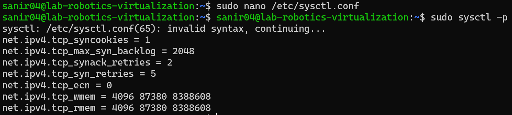

# Linux Server Firewall Configuration Report
- Sanir Subedi: amk1002731@student.hamk.fi
## Background

A firewall is a critical component in securing a server by filtering incoming and outgoing network traffic. In this exercise, we configure a firewall using UFW (Uncomplicated Firewall) on a Linux server. The firewall will:

- Allow essential services (OpenSSH, HTTP, and HTTPS).
- Log all blocked and allowed connections.
- Protect against common network attacks such as SYN floods and ICMP floods.
- Implement additional security measures.

## Firewall Configuration

### Enable UFW on Startup
To ensure UFW starts automatically when the system boots:
```bash
sudo systemctl enable ufw  # Enables UFW on startup
sudo ufw enable  # Activates UFW
```

### Set Default Policies
By default, we deny all incoming traffic and allow outgoing traffic:
```bash
sudo ufw default deny incoming  # Blocks all incoming connections
sudo ufw default allow outgoing  # Allows all outgoing connections
```

### Allow Necessary Services

#### OpenSSH
Allows remote server management via SSH:
```bash
sudo ufw allow 22/tcp  # Allows SSH traffic on port 22
sudo ufw limit ssh comment 'Rate limit SSH connections'  # Mitigates brute-force attacks
```


#### Web Server (HTTP & HTTPS)
Allows web traffic:
```bash
sudo ufw allow 80/tcp  # Allows HTTP traffic
sudo ufw allow 443/tcp  # Allows HTTPS traffic
```


### Configure Logging
Logs all blocked and allowed connections:
```bash
sudo ufw logging on  # Enables logging
sudo ufw logging high  # Enables detailed logging
```
Log file location: `/var/log/ufw.log`


### Protect Against Common Attacks

#### SYN Flood Protection
SYN flood attacks exhaust server resources by sending numerous fake connection requests.

Mitigate them by modifying `/etc/sysctl.conf`:
```bash
sudo nano /etc/sysctl.conf
```
Add the following:
```plaintext
net.ipv4.tcp_syncookies = 1
net.ipv4.tcp_max_syn_backlog = 2048
net.ipv4.tcp_synack_retries = 2
net.ipv4.tcp_syn_retries = 5
net.ipv4.tcp_ecn = 0
net.ipv4.tcp_wmem = 4096 87380 8388608
net.ipv4.tcp_rmem = 4096 87380 8388608
```
Apply changes:
```bash
sudo sysctl -p
```


#### Block Invalid Packets
Prevents unauthorized connections that do not start with a proper SYN flag. Add these rules in `/etc/ufw/before.rules`:
```bash
sudo nano /etc/ufw/before.rules
```
Append:
```plaintext
-A ufw-before-input -p tcp -m tcp ! --tcp-flags FIN,SYN,RST,ACK SYN -m conntrack --ctstate NEW -j ufw-logging-deny
-A ufw-before-input -p tcp -m tcp ! --tcp-flags FIN,SYN,RST,ACK SYN -m conntrack --ctstate NEW -j DROP
```
For IPv6, add the same rules to `/etc/ufw/before6.rules`.

#### Block ICMP (Ping) Requests
ICMP flood attacks overwhelm a server by flooding it with ICMP echo requests (pings). Modify `/etc/ufw/before.rules`:
```bash
sudo nano /etc/ufw/before.rules
```
Comment out the following lines:
```plaintext
#-A ufw-before-input -p icmp --icmp-type echo-request -j ACCEPT
#-A ufw-before-forward -p icmp --icmp-type echo-request -j ACCEPT
```

# Apply the Change 

Reload UFW:
```bash
sudo ufw reload
```

### Additional Protection: Port Scanning Prevention
Port scanning is used by attackers to identify open ports. Block known port scan attempts:
```bash
sudo ufw deny from any to any port 135,139,445 proto tcp  # Blocks NetBIOS and SMB exploits
sudo ufw deny from any to any port 111,2049 proto tcp  # Blocks NFS-related attacks
```

## Verification & Monitoring

### Check Firewall Status
```bash
sudo ufw status verbose  # Displays firewall rules
```

### Test Service Accessibility
```bash
nc -zv localhost 22  # Tests SSH
nc -zv localhost 80  # Tests HTTP
nc -zv localhost 443  # Tests HTTPS
```

### Monitor Logs
```bash
sudo tail -n 5 /var/log/ufw.log  # Displays last 5 firewall logs
```

## Conclusion
This firewall configuration provides essential security for a Linux server by allowing necessary services while blocking unauthorized traffic. Additionally, it logs all activity, mitigates SYN flood attacks, and prevents ICMP-based DoS attacks. Further enhancements can be made based on specific server needs and threat analysis.

---


