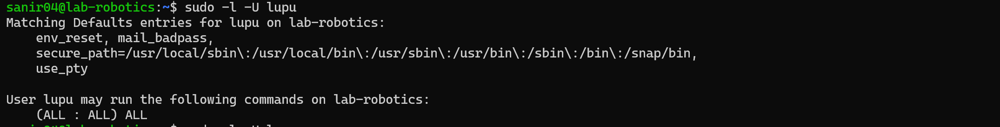
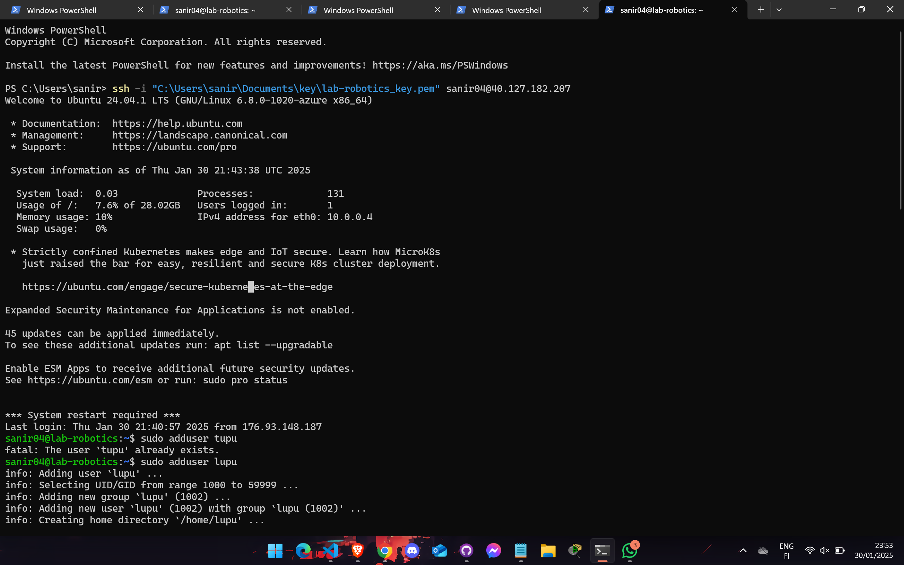

# 2025 / 01/ 20
 - Sanir Subedi, amk1002731@student.hamk.fi


# Step 1: Create an Azure Account
- Visit portal.azure.com and sign up using your university email.
- Verify your university status to access free Azure credits.
# Step 2: Activate Free Azure Credits
- Navigate to the Azure for Students program page and activate your free credits. 

# Step 3: Create a New Virtual Machine
- Go to the Create a resourse and click on Virtual Machine.


#  Step 4: Choose the Region and Operating System
- Set the Region to North Europe for optimal performance and compatibility.
- Select Ubuntu Server 24.04 LTS  x64 Gen2 as the operating system to benefit from the latest LTS release.

# Step 6: Configure VM Size
- Choose the Standard_B2ls_v2 size, providing 2 vCPUs and 4 GiB of memory.
- Check the estimated monthly cost ($33.29) and ensure it aligns with your Azure credits.

# Step 7: Network Configuration

Configure the network by:
- Assigning a Public IP address for external access.
- Creating a Network Interface for internal VM communication.
- Setting a username for secure access.

# Step 8: Configure Storage

- Select OS Disk Type as Standard SSD for moderate performance at a lower cost.
- Opt for Locally-redundant storage to ensure data reliability within the selected region.

# Step 9: Assign a Static Public IP
- Assign a Static Public IP and name it (e.g., lab-robotics-ip) for consistent external access.

# Step 10: Set Inbound Ports

- HTTP (80) for web server traffic.
- HTTPS (443) for secure web connections.
- SSH (22) for remote terminal access.

# Step 11: Enable Auto-Shutdown

- Enable Auto-shutdown to save costs during inactivity:
- Set the shutdown time to 10:00 PM (UTC+2, Helsinki).
- Use the local time zone for scheduling convenience.

# Step 12: Review and Create
- Review all the settings to ensure correctness.
- Click Create to deploy the virtual machine.

# Step 13: Connect to the Virtual Machine
- In the Azure portal, select the VM (lab-robotics).
- Click Connect and choose Native SSH.
- Copy the connection command displayed, which includes the path to the key.pem file. 
- Ensure the key.pem file is securely stored on your local system.
- Open a terminal, navigate to the file's directory, and run the connection command.
- Accept the SSH fingerprint prompt by typing yes if prompted.
- You're now connected to your Azure VM!

# Images 


# 30/01/2025

# amk1002731@student.hamk.fi
## Step 1:
- First of all I create two users named **tupu** and **lupu**.
- Then set **password** and other necessary information so that only that user can access the file.
- I used sudo and adduser command for that.

```bash
sudo adduser tupu
```

## Step 2:
- Then I create lupu user using useradd command.

```bash
sudo useradd -m -d /home/lupu -s /bin/bash -G lupu lupu
```

- -m: Create the user's home directory.
- -d /home/lupu: Specify the home directory path.
- -s /bin/bash: Set the login shell to /bin/bash.
- -G lupu: Add the user to the lupu group.

## Step 3: 
- Furthermore, I create the hupu system user with the login shell set to **/bin/false** file.

```bash
sudo useradd --system --shell /bin/false hupu
```

- --system: Create a system account.
- --shell /bin/false: Set the login shell to /bin/false to prevent login.

## Step 4: 
- Then I use **visudo** to edit the sudoers file

```bash
sudo visudo
```

- Then add the following lines for both users:

```plaintext
tupu ALL=(ALL:ALL) ALL
lupu ALL=(ALL:ALL) ALL
```

- There is another method as well but I present here only the above one, though I ran both.

## Step 5:
- I create a directory in **/opt/projekti** and add both users

```bash
sudo mkdir /opt/projekti
```

- Then create a group called projekti and assign both tupu and lupu into the group with the commands:

```bash
sudo groupadd projekti
sudo usermod -aG projekti tupu
sudo usermod -aG projekti lupu
```

- And give ownership to the projekti group.

```bash
sudo chown :projekti /opt/projekti
```

- And **set permission** so that tupu and lupu can access the files in all three formats like read, write, and execute.

```bash
sudo chmod 770 /opt/projekti
```

- The following command ensures that any new files created within the /opt/projekti directory inherit the group ownership of projekti, maintaining the desired permissions.

```bash
sudo chmod g+s /opt/projekti
```

## Output:

```plaintext
drwxrws--- 2 root projekti 4096 Jan 30 16:02 /opt/projekti


# image 

   