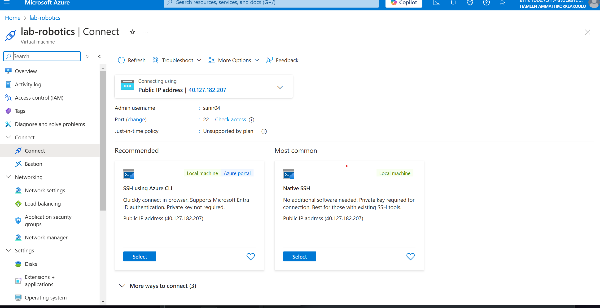

# 2025 / 01/ 20
 - Sanir Subedi, amk1002731@student.hamk.fi

# Step 1: Create an Azure Account
- Visit portal.azure.com and sign up using your university email.
- Verify your university status to access free Azure credits.
# Step 2: Activate Free Azure Credits
- Navigate to the Azure for Students program page and activate your free credits. 

# Step 3: Create a New Virtual Machine
- Go to the Create a resourse and click on Virtual Machine.

#  Step 4: Choose the Region and Operating System
- Set the Region to North Europe for optimal performance and compatibility.
- Select Ubuntu Server 24.04 LTS  x64 Gen2 as the operating system to benefit from the latest LTS release.

# Step 6: Configure VM Size
- Choose the Standard_B2ls_v2 size, providing 2 vCPUs and 4 GiB of memory.
- Check the estimated monthly cost ($33.29) and ensure it aligns with your Azure credits.

# Step 7: Network Configuration

Configure the network by:
- Assigning a Public IP address for external access.
- Creating a Network Interface for internal VM communication.
- Setting a username for secure access.

# Step 8: Configure Storage

- Select OS Disk Type as Standard SSD for moderate performance at a lower cost.
- Opt for Locally-redundant storage to ensure data reliability within the selected region.

# Step 9: Assign a Static Public IP
- Assign a Static Public IP and name it (e.g., lab-robotics-ip) for consistent external access.

# Step 10: Set Inbound Ports

- HTTP (80) for web server traffic.
- HTTPS (443) for secure web connections.
- SSH (22) for remote terminal access.

# Step 11: Enable Auto-Shutdown

- Enable Auto-shutdown to save costs during inactivity:
- Set the shutdown time to 10:00 PM (UTC+2, Helsinki).
- Use the local time zone for scheduling convenience.

# Step 12: Review and Create
- Review all the settings to ensure correctness.
- Click Create to deploy the virtual machine.

# Step 13: Connect to the Virtual Machine
- In the Azure portal, select the VM (lab-robotics).
- Click Connect and choose Native SSH.
- Copy the connection command displayed, which includes the path to the key.pem file. 
- Ensure the key.pem file is securely stored on your local system.
- Open a terminal, navigate to the file's directory, and run the connection command.
- Accept the SSH fingerprint prompt by typing yes if prompted.
- You're now connected to your Azure VM!

# Images 

